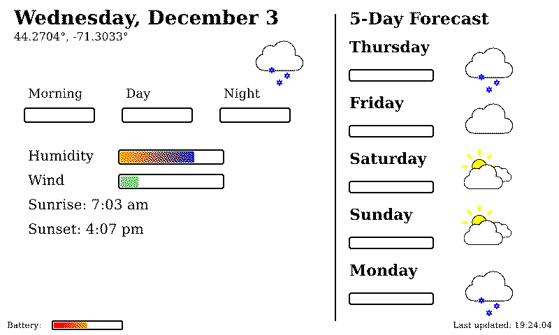
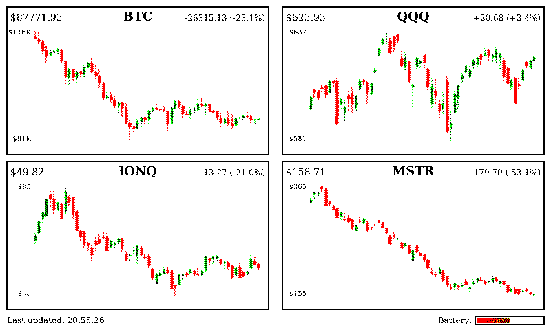
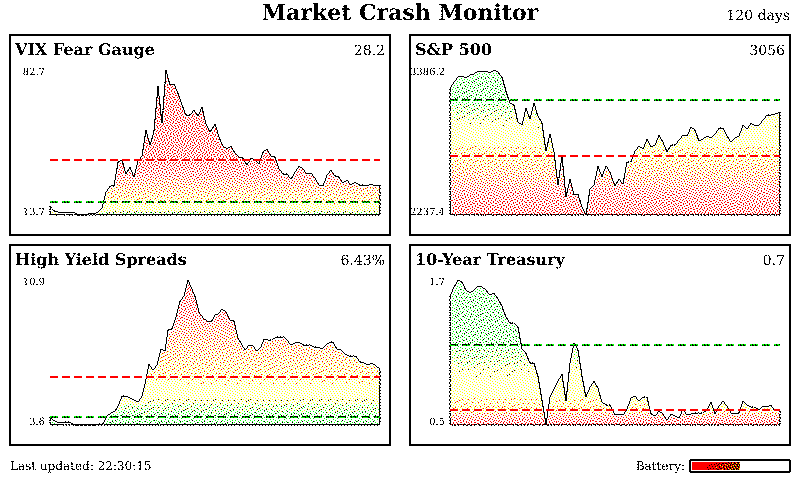

This is an experiment in AI-generated code.

It consists of:

 - A backend service, which fetches weather and stock data, and serves an IOT-friendly binary image via HTTP.
 - A frontend client, which fetches the binary image from the backend and displays it.

The backend is currently written in Rust. The frontend currently uses the Arduino core for the ESP32.

## Examples

### Weather Display

### Stock Charts

### Federal Reserve Charts

